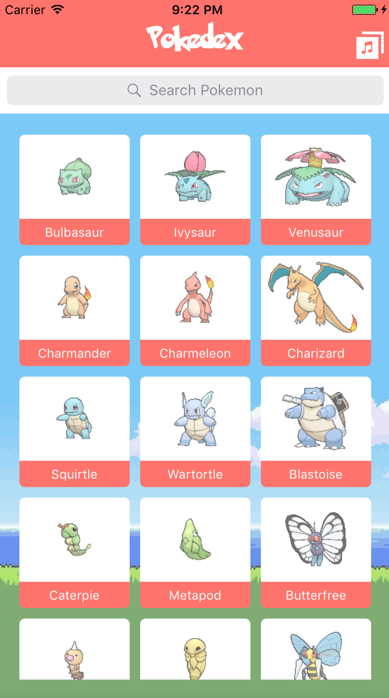
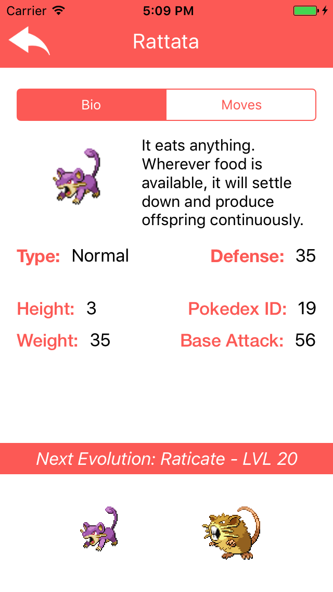
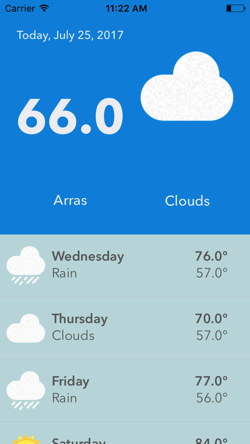
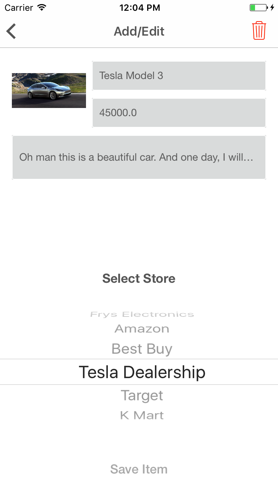

# Devslopes Swift Course for iOS 10 Development

This is a [Udemy course](https://www.udemy.com/devslopes-ios10) by Devlopes to learn advanced Swift 3 for iOS 10 development

## Pokedex App

This app uses [alamofire](https://github.com/Alamofire/Alamofire) 'is an HTTP networking library written in Swift' and [pokeapi](https://pokeapi.co/) 'a free RESTful Pokémon API'

## Weather App

This app uses [alamofire](https://github.com/Alamofire/Alamofire) for HTTP requests and [openweathermap](https://openweathermap.org/) weather API

## DreamLister App

This app uses [Core Data](https://developer.apple.com/documentation/coredata) to add/update/remove items

